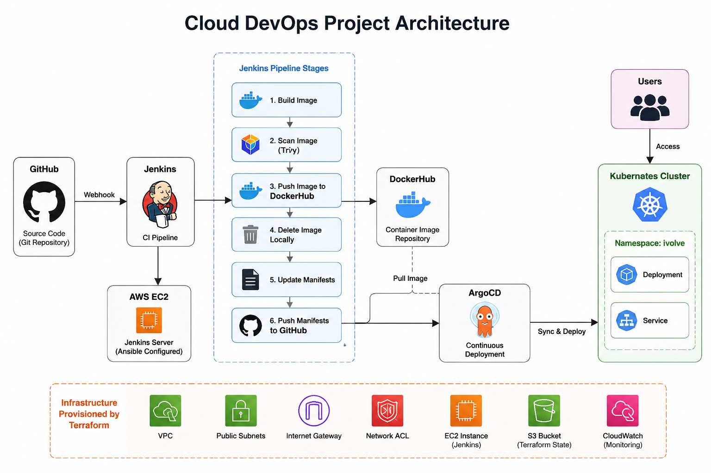
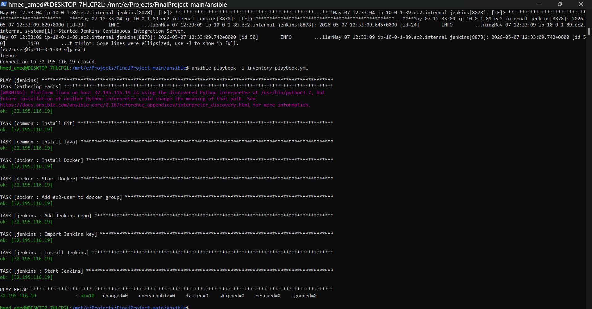
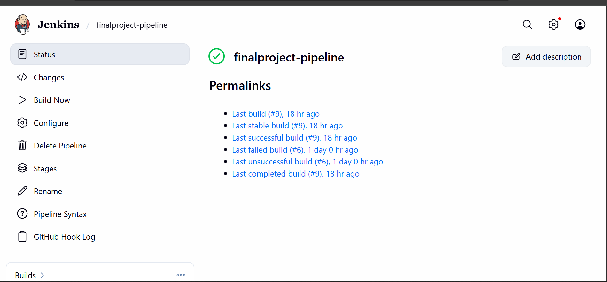
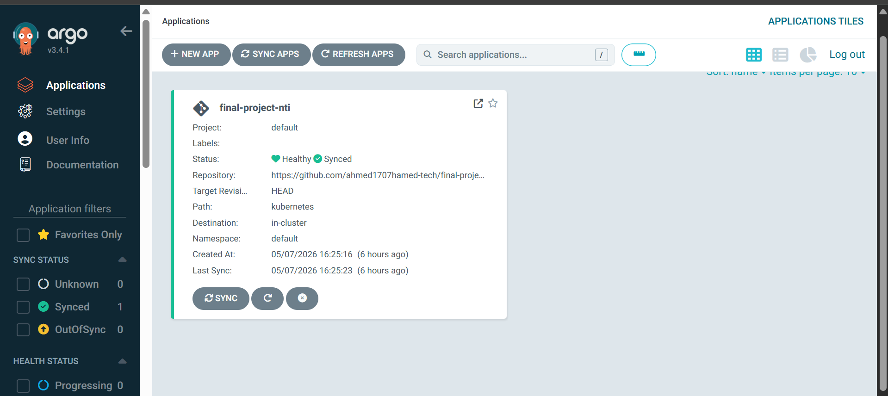
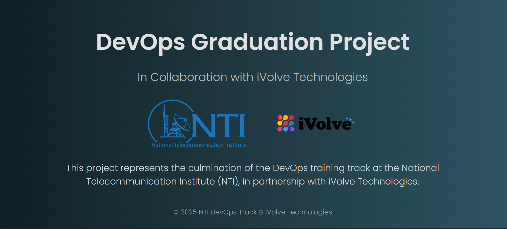

# Cloud DevOps Graduation Project

## Project Overview

This project represents the implementation of a complete DevOps CI/CD pipeline for deploying a containerized Python application using modern DevOps tools and cloud technologies.

The project was developed as part of the NTI DevOps Training Program in collaboration with iVolve Technologies.

---

# Architecture Diagram



---

# Technologies Used

- Git & GitHub
- Docker
- Kubernetes (Minikube)
- Jenkins
- ArgoCD
- Terraform
- Ansible
- AWS EC2
- DockerHub
- Trivy

---

# Project Workflow

```text
GitHub Repository
        ↓
Jenkins CI Pipeline
        ↓
Docker Image Build
        ↓
Trivy Security Scan
        ↓
Push Image to DockerHub
        ↓
Update Kubernetes Manifests
        ↓
Push Changes to GitHub
        ↓
ArgoCD Sync & Deploy
        ↓
Kubernetes Cluster
```

---

# Infrastructure Provisioning with Terraform

Terraform was used to provision AWS infrastructure components including:

- VPC
- Public Subnets
- Internet Gateway
- Network ACL
- Security Groups
- EC2 Instance for Jenkins
- S3 Backend for Terraform State
- CloudWatch Monitoring

---

# Configuration Management with Ansible

Ansible was used to automate EC2 server configuration.

### Configured Services

- Git
- Docker
- Java
- Jenkins

### Features

- Ansible Roles
- Dynamic Inventory
- Automated Jenkins Setup

---

# Ansible Playbook Execution



---

# Docker Containerization

The application was containerized using Docker.

### Docker Features

- Custom Dockerfile
- Lightweight Python Image
- DockerHub Integration

### Build Docker Image

```bash
docker build -t ahmed7amed9/finalproject:v1 .
```

### Run Docker Container

```bash
docker run -d -p 5000:5000 ahmed7amed9/finalproject:v1
```

---

# Kubernetes Deployment

The application was deployed to Kubernetes using:

- Deployment
- Service
- Namespace (`ivolve`)

### Kubernetes Commands

```bash
kubectl get pods -A
kubectl get svc -A
```

---

# Jenkins CI/CD Pipeline

Jenkins was used to automate the CI/CD workflow.

### Pipeline Stages

- Build Docker Image
- Scan Image with Trivy
- Push Image to DockerHub
- Delete Local Image
- Update Kubernetes Manifests
- Push Changes to GitHub

---

# Jenkins Pipeline Screenshot



---

# Continuous Deployment with ArgoCD

ArgoCD was configured for GitOps-based continuous deployment.

### Features

- Automatic Sync
- Self-Healing
- Kubernetes Deployment Automation

---

# ArgoCD Dashboard



---

# Project Overview Screenshot



---

# Repository Structure

```text
FinalProject-main/
│
├── ansible/
├── argocd/
├── kubernetes/
├── terraform/
├── templates/
├── static/
├── Dockerfile
├── Jenkinsfile
├── app.py
├── requirements.txt
└── README.md
```

---

# Setup Instructions

## Clone Repository

```bash
git clone https://github.com/ahmed1707hamed-tech/final-project-NTI.git
```

---

## Start Minikube

```bash
minikube start
```

---

## Apply Kubernetes Manifests

```bash
kubectl apply -f kubernetes/
```

---

## Deploy ArgoCD Application

```bash
kubectl apply -f argocd/application.yaml -n argocd
```

---

# Future Improvements

- Deploy on AWS EKS
- Configure Ingress Controller
- Add HTTPS Support
- Implement Monitoring with Prometheus & Grafana
- Add Helm Charts
- Configure Jenkins Shared Libraries

---

# Author

Ahmed Hamed

NTI DevOps Track – iVolve Technologies

